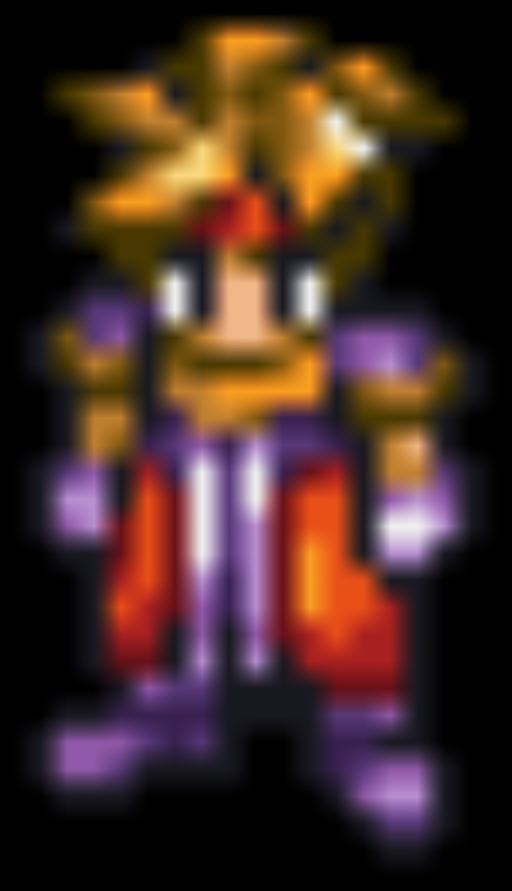
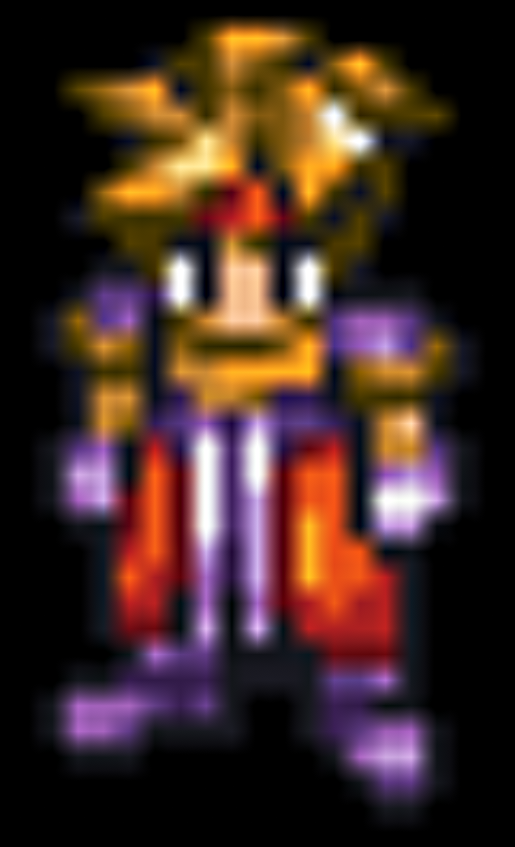
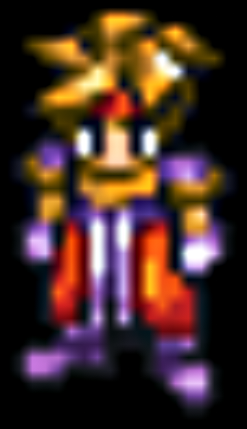
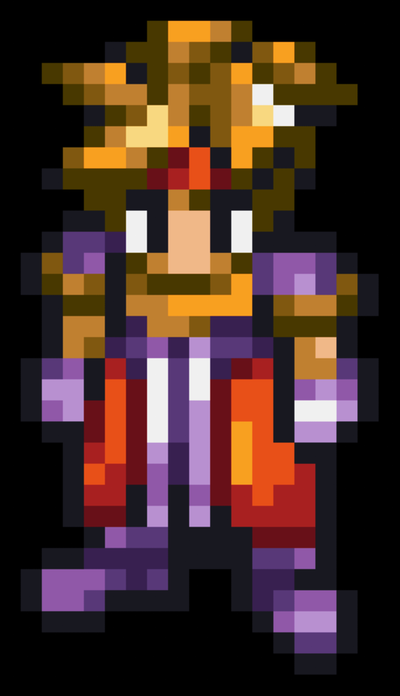
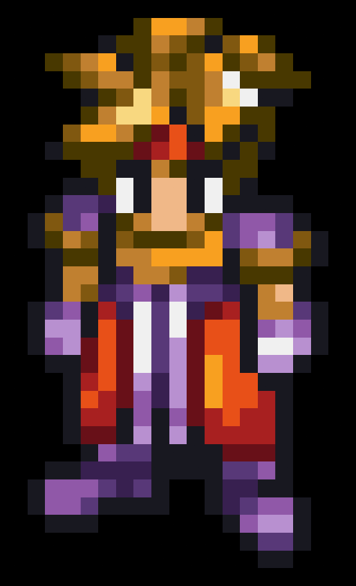
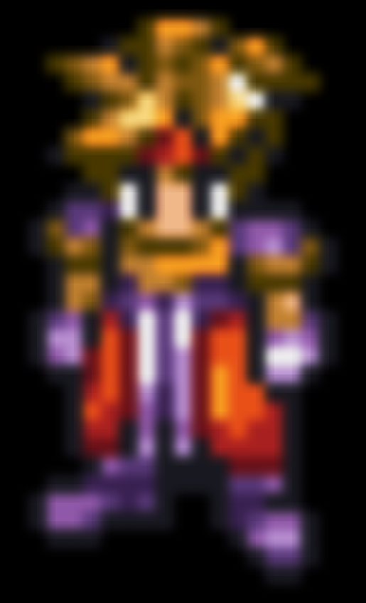
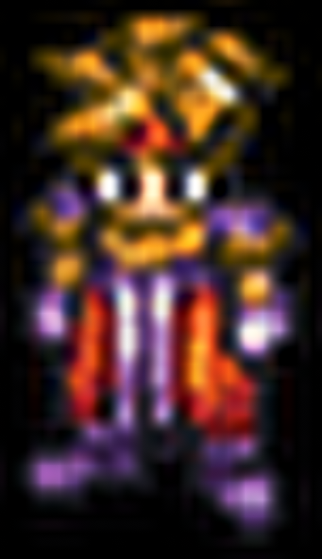
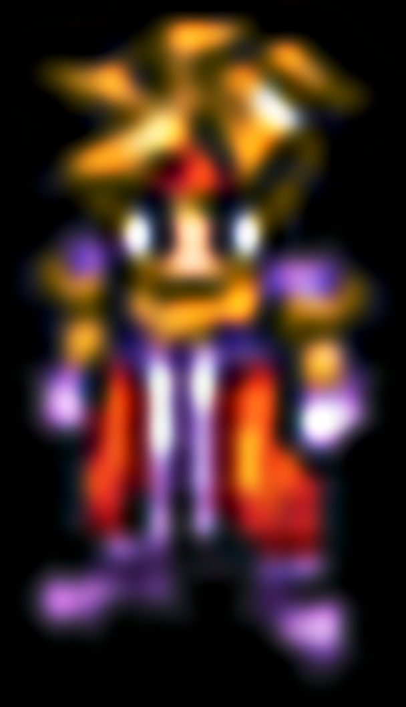

# Ark

    scale=bilinear

    scale=bicubic_fast

    scale=sharpen3

    scale=sharpen5

    scale=oversample

    scale=nearest

    scale=triangle

    scale=hanning

    scale=hamming

    scale=quadric

    scale=bicubic

    scale=kaiser

    scale=catmull_rom

    scale=mitchell

    scale=hermite

    scale=robidoux

    scale=robidouxsharp

    scale=spline16

    scale=spline36

    scale=spline64

    scale=gaussian

    scale=sinc

    scale=ewa_lanczos

    scale=ewa_hanning

    scale=ewa_ginseng

    scale=ewa_lanczossharp

    scale=lanczos

    scale=blackman

    scale=haasnsoft

