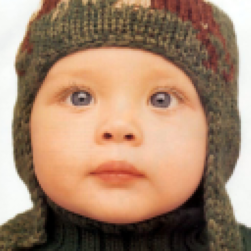

# Baby

    scale=bilinear

    scale=bicubic_fast

    scale=sharpen3

    scale=sharpen5

    scale=oversample

    scale=spline16

    scale=spline36

    scale=spline64

    scale=sinc

    scale=lanczos

    scale=ginseng

    scale=jinc

    scale=ewa_lanczos

    scale=ewa_hanning

    scale=ewa_ginseng

    scale=ewa_lanczossharp

    scale=ewa_lanczossoft

    scale=haasnsoft

    scale=bicubic

    scale=bcspline

    scale=catmull_rom

    scale=mitchell

    scale=robidoux

    scale=robidouxsharp

    scale=nearest

    scale=gaussian

