# Hash

    scale=bilinear
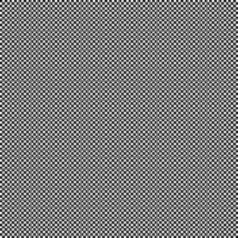

    scale=bicubic_fast

    scale=sharpen3

    scale=sharpen5
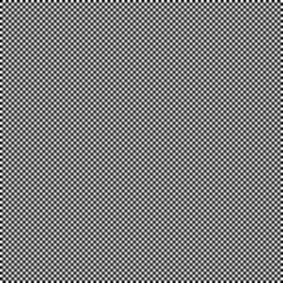

    scale=oversample
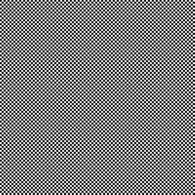

    scale=spline16
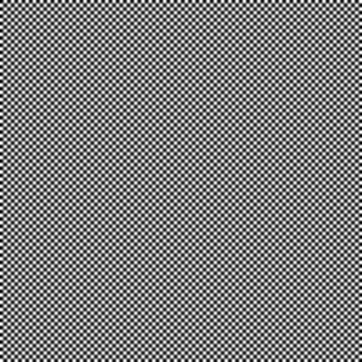

    scale=spline36
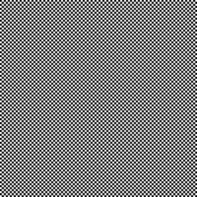

    scale=spline64
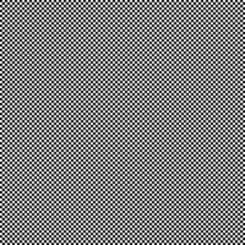

    scale=sinc

    scale=lanczos

    scale=ginseng
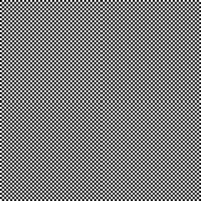

    scale=jinc

    scale=ewa_lanczos

    scale=ewa_hanning
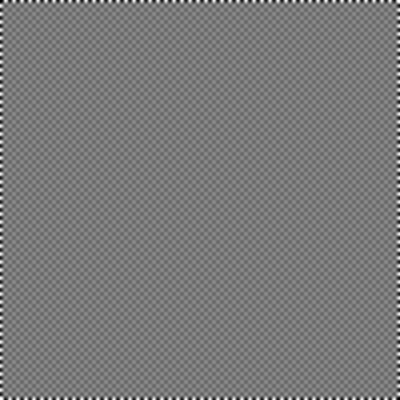

    scale=ewa_ginseng

    scale=ewa_lanczossharp

    scale=ewa_lanczossoft

    scale=haasnsoft

    scale=bicubic

    scale=bcspline

    scale=catmull_rom

    scale=mitchell
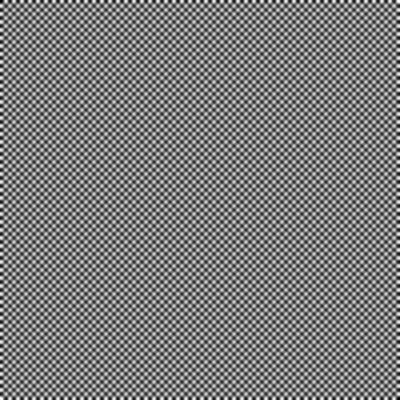

    scale=robidoux
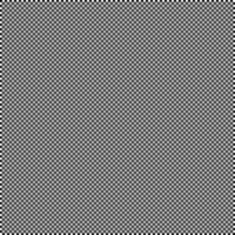

    scale=robidouxsharp
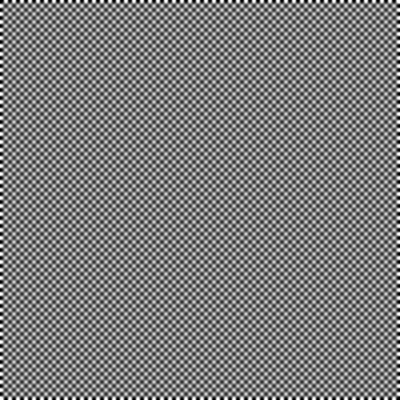

    scale=box

    scale=nearest
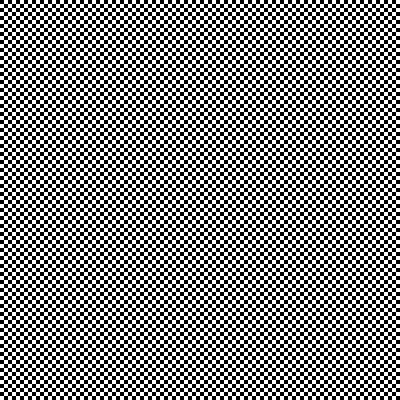

    scale=triangle
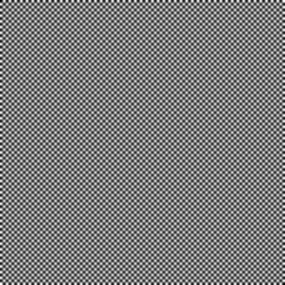

    scale=gaussian
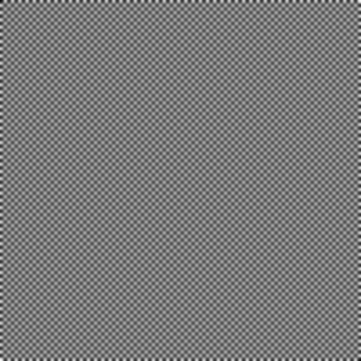
