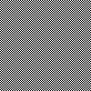
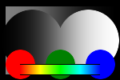

Upscaling
=========

There are many available upscaling (interpolation) techniques in mpv, of which this article aims to provide some comparison screenshots.

Methodology
===========

Each of the screenshots was obtained like this:

    mpv --no-config --pause rose.png --geometry=560x368 -vo opengl-hq:dither-depth=8:scale=SCALER:cscale=SCALER

The resulting output was captured using imagemagick:

    import -depth 8 SCALER.png

All of this is automated using a script, as can be found [here](https://github.com/haasn/cms/blob/master/scalers.sh).

Antiringing
===========

Some of the upscalers support antiringing, which is a naive technique that attempts to reduce ringing in some cases, but can also introduce artifacts. The antiringing algorithm in mpv is not very sophisticated. The rose test pattern includes a few examples.

Other upscaling methods
=======================

There are also ways to upscale images other than by using the scale option, such as using a vapoursynth script (eg. NNEDI3). The rose test pattern includes this as an example.

Results
=======

Click on an image to see the upscaled versions.

