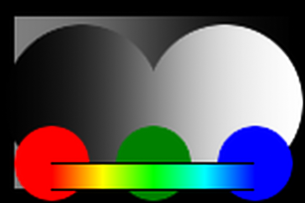

# Windows

    scale-window=box

    scale-window=triangle

    scale-window=hanning

    scale-window=hamming

    scale-window=quadric

    scale-window=welch

    scale-window=petsu

    scale-window=petsu:scale=wparam=1.5

    scale-window=kaiser

    scale-window=blackman

    scale-window=gaussian

    scale-window=sinc

    scale-window=jinc

    scale-window=sphinx

